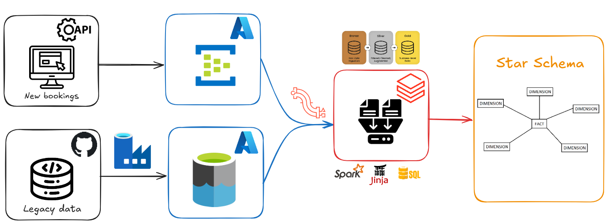
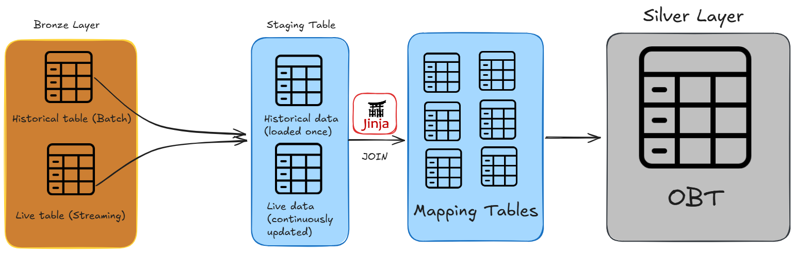
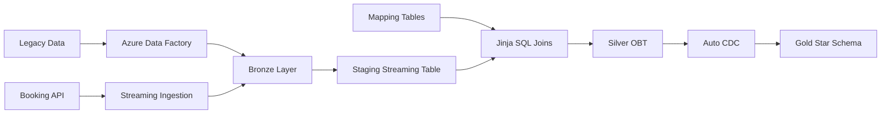
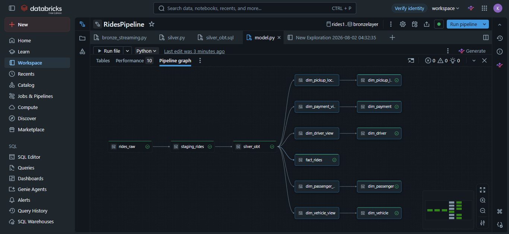

# 🚖 Ride Booking Lakehouse Pipeline


An end-to-end streaming data engineering project built using Azure, Databricks, Delta Lake, and Lakeflow Declarative Pipelines.

## 🏗 Architecture

<p align="center">
    
</p>

## Bronze → Silver Processing

<p align="center">
    
</p>

## 🛠 Tech Stack

| Category | Technology |
|-----------|------------|
| Cloud | Microsoft Azure |
| Data Factory | Azure Data Factory |
| Storage | Azure Data Lake Storage Gen2 |
| Compute | Azure Databricks |
| Streaming | Lakeflow Declarative Pipelines |
| Language | PySpark |
| SQL | Databricks SQL |
| Storage Format | Delta Lake |
| Modeling | Star Schema |
| BI | Power BI |


```text
RideBookingPipeline
│
├── bronze/
├── silver/
├── gold/
├── notebooks/
├── architecture/
│   ├── full.png
│   └── bronze_silver.png
├── README.md
```

## 📸 Lineage

<p align="center">

</p>


## ✨ Features

- Historical Batch Loading
- Real-Time Streaming Ingestion
- Medallion Architecture
- Delta Lake
- Lakeflow Declarative Pipelines
- Streaming Joins
- Watermarks
- Jinja SQL Templates
- Auto CDC
- SCD Type 1
- SCD Type 2
- Star Schema Modeling

